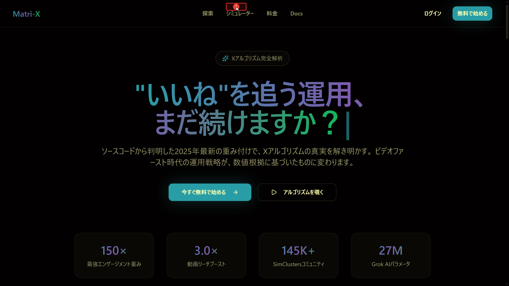
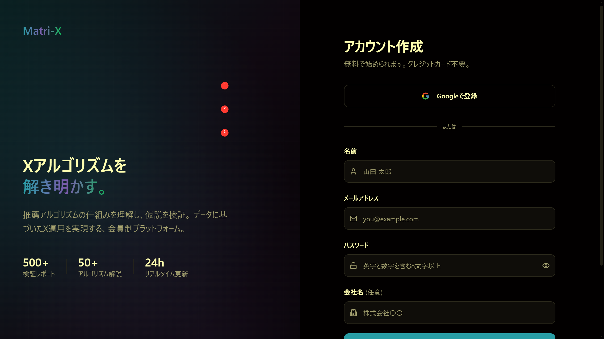
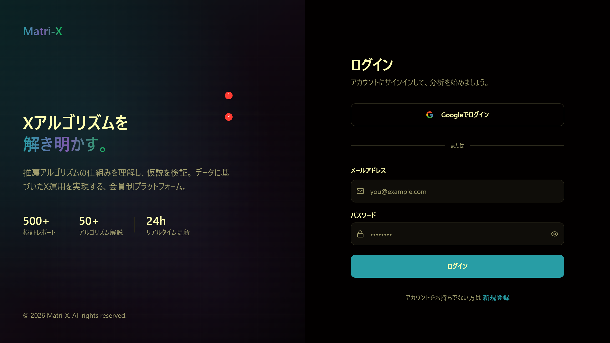

# アカウント登録

**Matri-Xへの登録方法を画面つきで解説します**

---

## 登録手順

### 1. Matri-Xにアクセス

[https://matri-x-algo.wiki](https://matri-x-algo.wiki) を開きます。

<figure><figcaption>Matri-X トップページ</figcaption></figure>

### 2. 「無料で始める」をクリック

トップページ右上の **「無料で始める」** ボタンをクリックします。

<figure><figcaption>ヘッダー右上の「無料で始める」をクリック</figcaption></figure>

### 3. 登録方法を選択

以下のいずれかで登録できます:

<figure><figcaption>アカウント登録ページ</figcaption></figure>

#### 🔑 Googleアカウントで登録（推奨）

1. 「Googleで登録」をクリック
2. Googleアカウントを選択
3. 許可を確認して完了

**推奨理由:**
- ワンクリックで登録完了
- パスワード管理不要
- セキュアな認証

#### 📧 メールアドレスで登録

1. **お名前** を入力（表示名として使用）
2. **メールアドレス** を入力
3. **パスワード** を設定（8文字以上）
4. 「登録する」をクリック
5. 確認メールが届くので、リンクをクリックして認証

---

## ログイン

登録済みの方は、ログインページからサインインします。

<figure><figcaption>ログインページ — Google認証またはメール+パスワードでログイン</figcaption></figure>

1. メールアドレスを入力
2. パスワードを入力
3. 「ログイン」をクリック

---

## 利用料金

Matri-Xは現在、**完全無料**でご利用いただけます。

### 使える機能

✅ フォーラム参加（質問・交流）  
✅ 開発チケット（機能リクエスト・バグ報告）  
✅ 通知システム  
✅ プロフィール管理  

### クレジットカード登録は不要

- 登録時にクレジットカード情報は**一切不要**です
- 完全無料でご利用いただけます

---

## 🚧 今後のプラン

将来的に、以下の機能を含む有料プランを予定しています：

| プラン | 月額 | 主な機能 |
|-------|------|---------|
| Free | ¥0 | フォーラム、基本アルゴリズム解説 |
| Standard | ¥2,980 | シミュレーター、エンゲージメント分析 |
| Pro | ¥5,980 | DeepWiki、週次レポート |
| Enterprise | お問い合わせ | API連携、チーム機能 |

詳細は決まり次第、お知らせします。

---

## よくある質問

### Q. 登録にクレジットカードは必要ですか？

A. **不要です。** 完全無料で利用できます。

### Q. Googleアカウント以外でも登録できますか？

A. はい、メールアドレスでも登録可能です。

### Q. 複数アカウント作れますか？

A. 1人1アカウントが原則です。

---

## トラブルシューティング

### 確認メールが届かない

1. 迷惑メールフォルダを確認
2. `noreply@matri-x-algo.wiki` からのメールを受信できるよう設定
3. それでも届かない場合は [お問い合わせ](../contact.md)

### ログインできない

- パスワードを忘れた場合 → 「パスワードをリセット」から再設定
- Googleアカウントでログインできない場合 → ブラウザのCookieをクリア

---

## 🚀 次のステップ

登録が完了したら:

1. [クイックスタート](quickstart.md) — 使い方を学ぶ
2. [フォーラム](../guides/forum.md) — コミュニティに参加
3. [開発チケット](../guides/tickets.md) — フィードバックを送る

---

**準備完了！さあ、始めましょう** 🎉

[Matri-Xにログイン](https://matri-x-algo.wiki/login)
